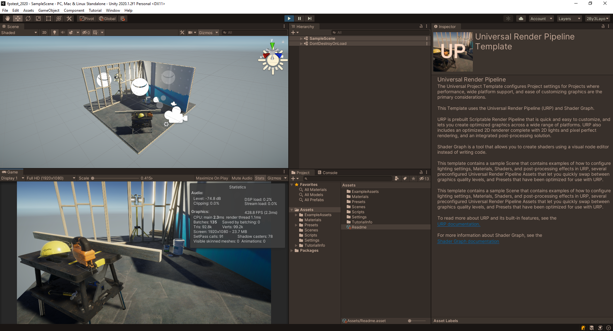
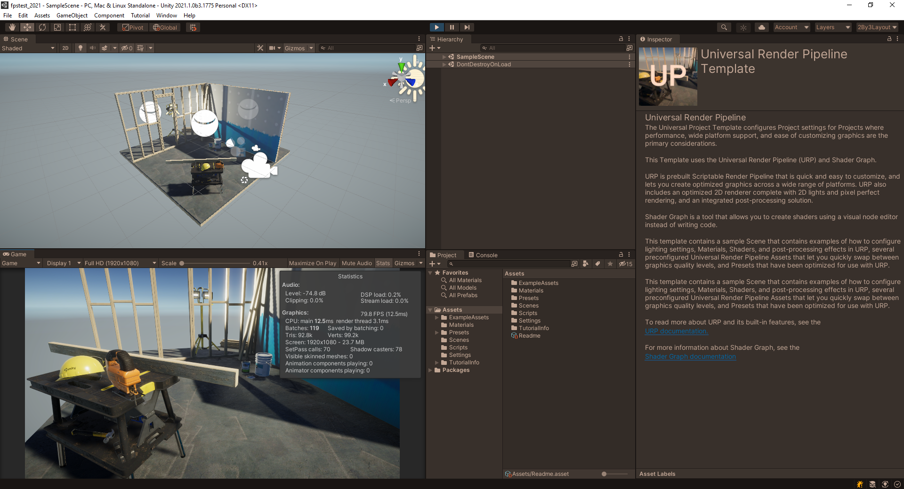
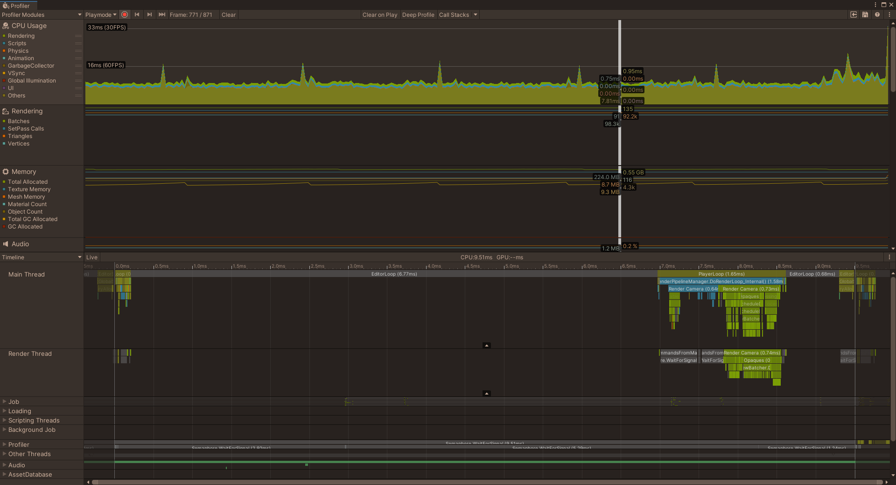
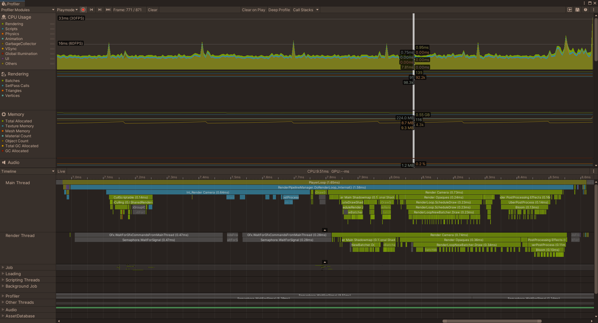
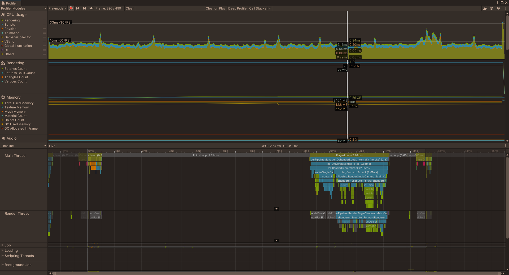
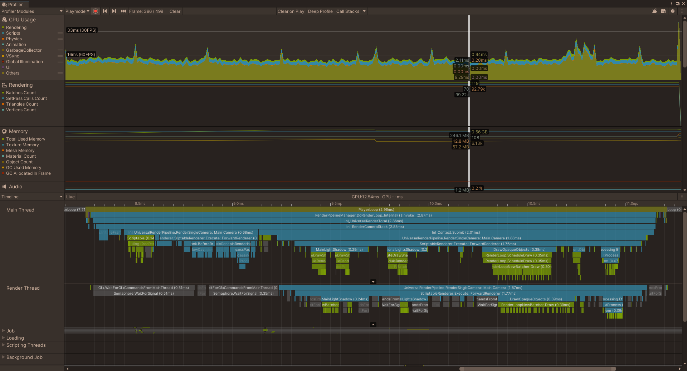

# 2020.1 vs 2021.1 URP performance issues

We've been studying the possibility to upgrade from Unity 2020.1.2f1 to Unity 2021.1.0b3. However, after upgrading, we've seen a huge FPS drop when running our project in the editor, to the point where testing new features on a heavier scene becomes undoable. 

We know in-editor performance is expected to be worse, and building the project would give us faster FPS, but this is not a sustainable development workflow. **It is not clear if this is something that is being worked on and we should expect improvements on future versions, or if this is the new baseline that we should expect for Unity after 2021.1.0b3. Any comments on that would be greatly appreciated!**

To show the issue happening, we created a new project on both Unity 2021.1 and 2020.1, using the standard URP template. No changes were made to either project or URP settings.

## FPS differences:

2020.1.2f1 shows an average of 420FPS (yea, i know :P)

2021.1.0b3 shows an average of 79FPS

## Profiler details:

Inspecting the profiler seems to indicate the biggest differences between both setups is that 2021.1 has significantly longer EditorLoop and RenderLoop times, and RenderLoop has a radically different structure too (which makes sense given the improvements we get with the newer URP):

### **2020.1**

Profiler overview:

Profiler showing the structure of the RenderLoop:

### **2021.1**

Profiler overview:

Profiler showing the structure of the RenderLoop:

# Summary

Is the in-editor performance in 2021.1 being improved for next versions or is this the new baseline we should expect for future versions? The answer to this question would make all the difference for us, and would help us make a better decision on whether or not to upgrade for an existing project.